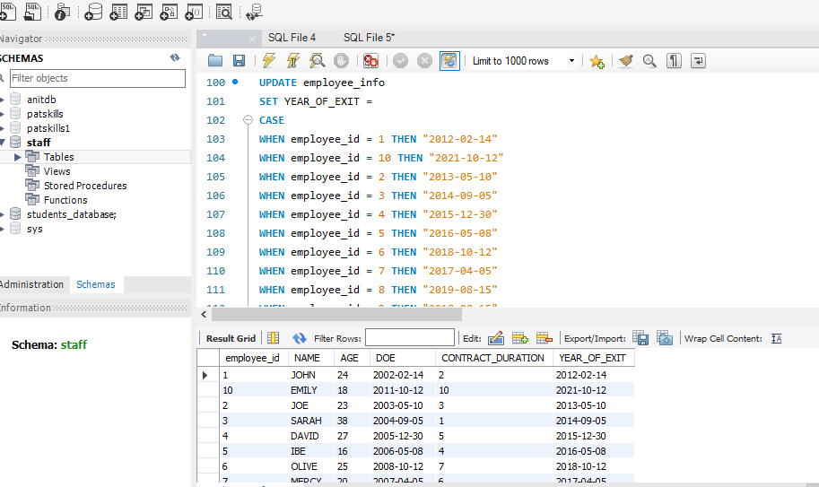
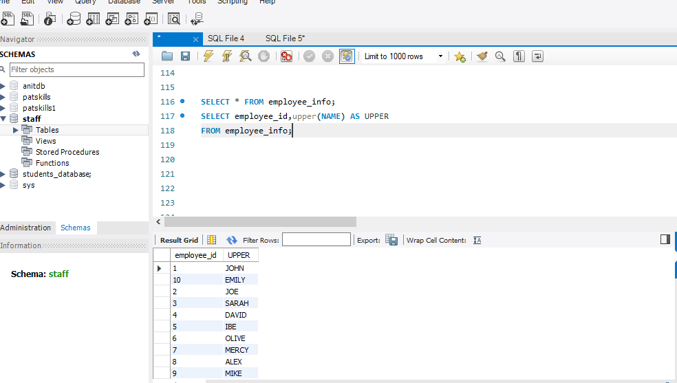

# SQLTASK3
## run a query that returns the MONTH,DAY,YEAR each employee came into the company

.PNG)

.PNG)

.PNG)

## run a query that adds 10 years to the year the employee came into the company as their YEAR_OF_EXIT

.PNG)

## update your table with the result above

## replace the department(communication) with stakeholders and show the result

.PNG)

## update the NAME column ensureing the values are in UPPER CASE

## run a query that will show the employees NAME and DOE in one column as EMPLOYEES BRIEF

.PNG)

